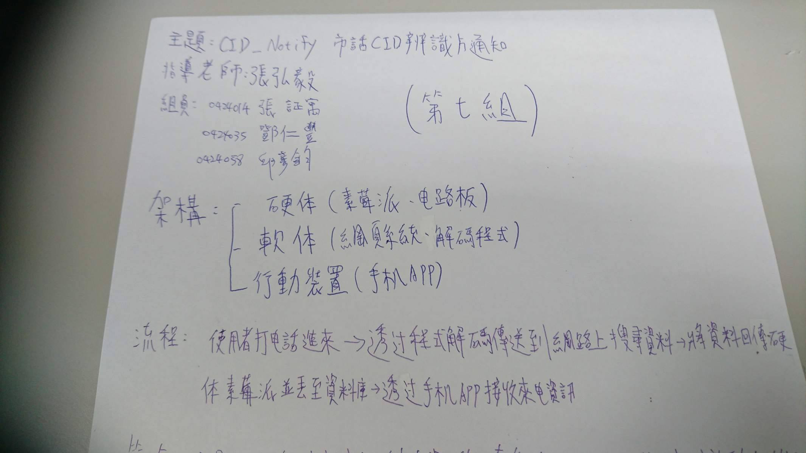
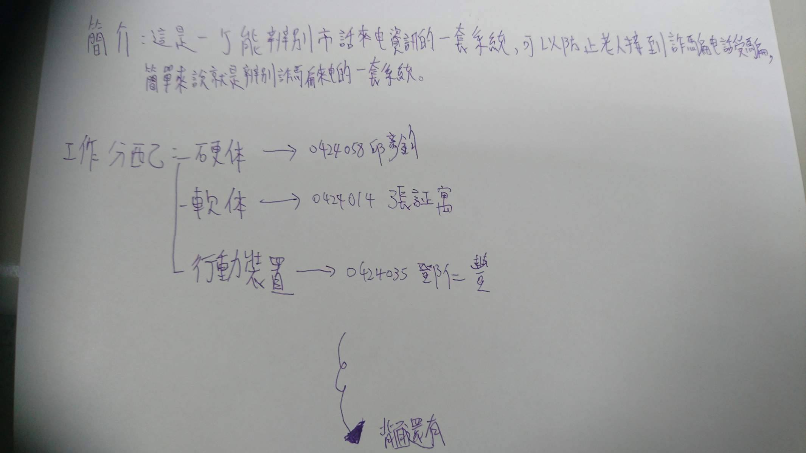
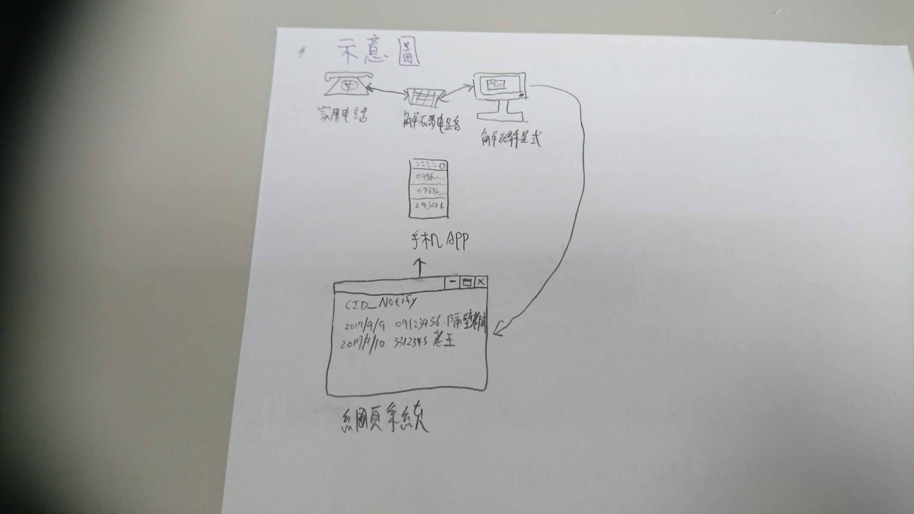

# CID_Notify 
* 組別 : 第7組
### 成員 
>* 0424014 張証寓
>* 0424058 邱彥鈞
>* 0424035 鄧仁豐

* 專題題目 : 市話CID辨識與通知
* 指導老師 : 張弘毅

<h3>需求定義</h3>
<h4>一、功能性需求</h4>

1.電話解碼：解碼來電訊號是什麼號碼

2.電話辨識：辨識來電單位判斷是否為詐騙電話

3.推播提醒：當家用電話接收到來電後將辨識過的資料發送至APP提醒在外的使用

<h4>二、功能性需求</h4>

1.個解碼電路和1台可連網的樹莓派

2.使用者在可連網的環境查詢並接收來電訊息

3.使用者需要有一台可連網且為安卓4.4以上的手機安裝APP

4.使用者需註冊並驗證過一組帳號查詢自家電話的來電紀錄

---------  

### 簡介

